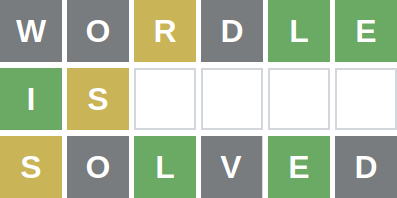
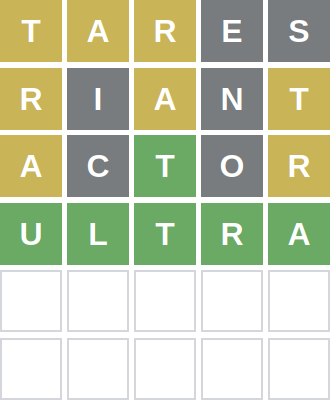

<div align="center">
    
</div>

An algorithm for finding the correct word in the popular game Wordle.

## Strategy explanation

The file [strategy.md](strategy.md) explains how the strategy works in detail.

## Usage

To play the game with assistance, just run:

```
python game.py
```

After each round, it will be necessary to input the play's outcome. A gray character is equivalent to 0, a yellow character is equivalent to 1, and a green character is equivalent to 2.

For example, the following game and commands are equivalent:

<div align="center">
    
</div>

```
tares (5191 possible answers)
11100
riant (30 possible answers)
10101
actor (5 possible answers)
10201
ultra (that is the only possible answer)
22222
You win! :-)
```

## Simulation

To measure the player's performance, the simulation runs 3547 games, each one having a different 5-character Portuguese word as the answer.

The player wins 3458 (97,46% of the) games, and  loses if the following words are the answer:

```
['aviar', 'gozar', 'gavar', 'xerva', 'gizar', 'ariar', 'nando', 'augar', 'treta', 'xarda', 'pizza', 'borba', 'circo', 'puxar', 'ninar', 'vazar', 'bobar', 'finar', 'vexar', 'imida', 'nanar', 'rezar', 'pujar', 'vivar', 'boiao', 'dinda', 'xingo', 'rufar', 'babar', 'bazar', 'trajo', 'romao', 'farra', 'rafar', 'ralar', 'arxar', 'rizar', 'raiar', 'vezar', 'ginga', 'verba', 'valar', 'relar', 'zelar', 'nocao', 'jatar', 'mijar', 'regar', 'jurua', 'imina', 'bofar', 'jarda', 'gafar', 'banjo', 'redar', 'bojar', 'xerga', 'favar', 'iriar', 'jogar', 'varja', 'gajar', 'curau', 'azado', 'jinga', 'gofar', 'vagar', 'vapor', 'arcar', 'jorra', 'desse', 'gabar', 'rodar', 'rogar', 'rixar', 'fixar', 'mambo', 'weber', 'fofar', 'rugar', 'jarra', 'rifar', 'bajar', 'barba', 'jugar', 'zavar', 'rajar', 'zarco', 'rojar', 'xango']
```

To simulate these results, run:

```
virtualenv wordle-solver
source wordle-solver/bin/activate
pip install tqdm==4.62.3
python simulation.py
deactivate
```

## Repository structure

```
.
├── meta                 # List of images used in documentation
│   ├── ...
├── data                 # List of words used to solve the game
│   ├── DELAS_PB.dic     # List of Portuguese words
├── player.py            # Implementation of the strategy
├── game.py              # Used to assist a manual play
├── simulation.py        # Used to measure the player's performance
├── strategy.md          # The explanation of how the strategy works
```