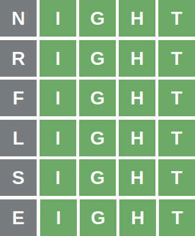

# Strategy explained

The general idea of the strategy consists of:

1. Keep a set of possible answers.
2. Score all words of this set using a weighted average of different criteria.
3. Play the word with the highest score.
4. Based on game feedback, apply rules to filter the set of possible answers.
5. Repeat these steps for each round until the end of the game.

In a nutshell, the strategy is a simulation that uses some optimizations to decrease the set of possible answers and some reasonable criteria to estimate the best guess for the next round.

Once the general idea is understood, we need to explore the details of the strategy. The game has different states, and the definition of the "best word to choose" changes depending on the current state. Sometimes, it will make sense to choose a word even knowing it is not the correct answer.

## Intuition

An initial and naive strategy would probably be a player that filters the set of possible answers using the rules and then chooses the word with the most frequent characters. However, that strategy would inevitably make the following mistake:

    

After discovering a correct position, the player insisted on winning in the next round. However, note that repeating a green character does not give additional information about the answer.

After choosing "chill," the player could have chosen a word that maximized the number of different letters. If instead of "spill," the player had chosen "kaput," it would have discovered the answer in a single round. Why "kaput"? Although "kaput" is clearly not the answer, the only possible words were {"skill," "spill," "still," "swill"}, and "kaput" contains the letters 'k', 'p' and 't.'

This example suggests the existence of different states. Each state has different strategies based on different goals.

## Filtering rules

Before discussing the game states, it is necessary to describe all rules the player uses to restrict the set of possible answers.

    

1. **Green character rule:** The correct word contains the green character on the position of the previous guess.
2. **Yellow character rule:** The correct word contains the yellow character, but not on the position of the previous guess.
3. **Gray character rule:** The correct word does not contain any gray character.
4. **Gray character optimization:** If no words in the set of the possible answers have a specific character, then that character is gray.
5. **Green character optimization:** If all words in the set of the possible answers have the same character in the same position, then that character is green.

## Game states

As we saw earlier, sometimes we will play to win, and other times we will play to discover unseen characters. Besides, sometimes we will score just the words in the set of the possible answers, and other times we will score all the words.

These different goals and approaches change based on the current state, which is set based on some specific conditions.

**Note:** Because of some optimizations and implementation details, the [player.py](player.py) did not explicitly reference the game states. However, they are conceptually fundamental to the strategy.

### Explore state

    

In this state, the goal is to reduce the size of the set of possible answers. To achieve that, the player will choose a word that maximizes the number of unseen characters, even if that word is not the correct answer. An unseen character is a character that we do not know if it is gray, yellow, or green.

Note that the "gray character optimization" plays an essential role in this state. The player should avoid exploring a character if it does not appear on the set of possible answers.

**Condition trigger:** No yellow characters to explore.

**Set of words to score:** All words.

### Find correct position state

    

If the player finds a yellow character and still does not know its correct position, it should focus on finding it.

Note that the player also should maximize the number of unseen characters. To achieve both goals, the player will apply the same scoring strategy of the explore state but only on words in the set of possible answers. The reason is that those words satisfy the "yellow character rule" and will surely guarantee new information about its correct position.

**Condition trigger:** At least one yellow character with unknown correct position exists.

**Set of words to score:** Possible answers.

### Try to win state

This state is achieved in the last round and differs from the previous states by ignoring the unseen characters. In this state, the player's goal is to guess a word that maximizes the chances of winning. It will do that using the absolute and relative frequencies of the words in the set of possible answers. We will see those definitions in the following section.

**Condition trigger:** The player is at the last round. It does not matter if there are yellow characters or not.

**Set of words to score:** Possible answers.

## Scoring

Scoring means assigning a number to some object to determine if this object is "good" or "bad." Scoring multiple objects allows comparisons to classify which one is the best.

In our context, we will score all words in a given set and guess the one with the highest score.

There are three different ways to measure if a word is good or not. Each way can provide a score with different magnitudes, so the player must normalize them to a number between 0 and 1 to allow a combination without bias.

The final score is a [convex combination](https://en.wikipedia.org/wiki/Convex_combination) with arbitrary weights. The weights change depending on the state of the game. For example, in the try to win state, the weight of the number of unseen characters is zero.

### Absolute frequency of each letter

The absolute frequency of a letter is how many times that letter appears on the words of the language. In Portuguese, "a" is the most common letter, with 88126 apparitions. In English, however, the letter "a" appears 53798 times, but the most common letter is "e," with 64239 apparitions.

### Relative frequency of each letter

Besides the frequency of each letter, it is important to consider the frequency of each letter in each position. In Portuguese, the letter "a" appears 339 times as the first letter, 846 times as the second letter, 274 as third, 793 as fourth, and 1012 as fifth. Note that the sum of these frequencies is not 88126. The relative frequency considers only words with five characters, while the absolute frequency considers all words.

### Number of unseen characters

The importance of the unseen characters was already described in the section of explore and find correct positions states.